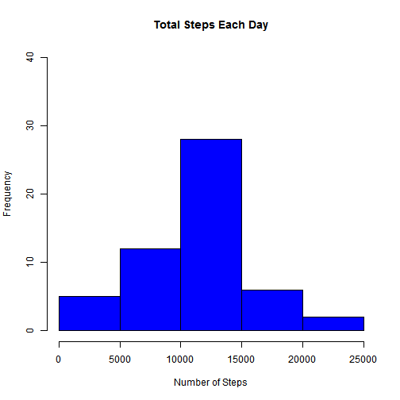
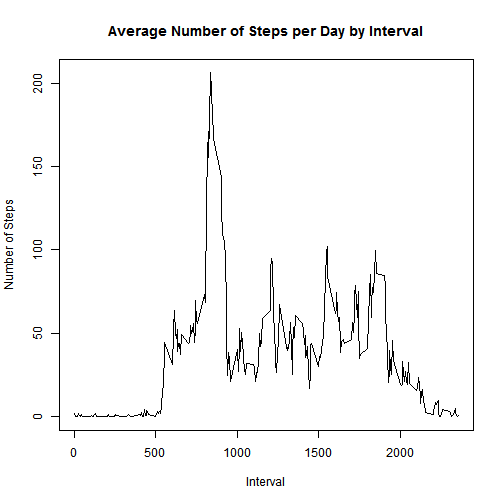
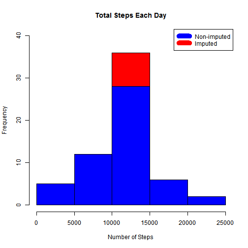
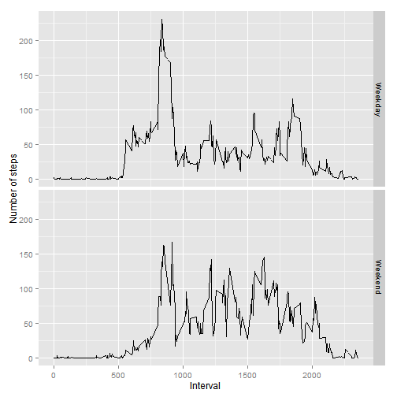

# **Data Analysis of Activity Monitoring Device**
### **Reproducible Research: Peer Assessment 1**

by Phyyu

This assignment makes use of data from a personal activity monitoring device. This device collects data at 5 minute intervals through out the day. The data consists of two months of data from an anonymous individual collected during the months of October and November, 2012 and include the number of steps taken in 5 minute intervals each day.


### **Loading and preprocessing the data**

First, load the data and unzip the data file.


```r
if(!file.exists("data")){
        dir.create("data")
        }
fileUrl<-"http://d396qusza40orc.cloudfront.net/repdata%2Fdata%2Factivity.zip"
download.file(fileUrl, destfile="./data/activity.zip", mode="wb")
unzip("./data/activity.zip", exdir="./data")
##activityData is the raw data.
activityData <- read.csv("./data/activity.csv")
```
  


### **What is mean total number of steps taken per day?**

In this part, the total number of steps taken per day is calculated, a histogram based on that is made. 


```r
##stepsDaily is used to store the total steps number each day
stepsDaily <- aggregate(steps ~ date, data=activityData, FUN=sum)
hist(stepsDaily$steps, main = "Total Steps Each Day", col="blue", xlab="Number of Steps", ylim=c(0,40))
```

 

The mean and median of steps taken per day are calculated as well.

```r
 stepsMean<- format(mean(stepsDaily$steps), digits= 5, scientific=TRUE)
 stepsMedian<- median(stepsDaily$steps)
```

**The mean is 1.0766e+04, and the median is 10765.**


### **What is the average daily activity pattern?**

A time series plot (i.e. type = "l") of the 5-minute interval (x-axis) and the average number of steps taken, averaged across all days (y-axis) is made.


```r
##stepsInterval is used to store the subset of the average number of steps taken every 5-minute interval
stepsInterval <- aggregate(steps~ interval, data=activityData, FUN= mean)
plot(stepsInterval, type="l", xlab="Interval", ylab="Number of Steps",main="Average Number of Steps per Day by Interval")
```

 

Which 5-minute interval, on average across all the days in the dataset, contains the maximum number of steps?


```r
stepsMax <- stepsInterval$interval[which.max(stepsInterval$steps)]
```

**One 5-minute interval, on average across all the days in the dataset, contains the maximum number of steps is 835.**


### **Imputing missing values**

1. Calculate and report the total number of missing values in the dataset (i.e. the total number of rows with NAs)


```r
naSum <-sum(is.na(activityData))
```

**The total number of missing values in the dataset is 2304.**


2. Devise a strategy for filling in all of the missing values in the dataset. The strategy does not need to be sophisticated. For example, you could use the mean/median for that day, or the mean for that 5-minute interval, etc.
Create a new dataset that is equal to the original dataset but with the missing data filled in.


```r
##activity is used to stored the imputed dataset
activity <- merge(activityData, stepsInterval, by = "interval", suffixes = c("", ".y")) ##right join
nas <- is.na(activity$steps)
activity$steps[nas] <- activity$steps.y[nas]
activity <- activity[, c(1:3)]
```


3. Make a histogram of the total number of steps taken each day and Calculate and report the mean and median total number of steps taken per day. Do these values differ from the estimates from the first part of the assignment? What is the impact of imputing missing data on the estimates of the total daily number of steps?


```r
stepsDaily_imputed <- aggregate(steps ~ date, data = activity, FUN = sum)

#Create two histograms to show difference. 
hist(stepsDaily_imputed$steps, main = "Total Steps Each Day", col="red", xlab="Number of Steps", ylim=c(0,40))

hist(stepsDaily$steps, main ="Total Steps Each Day", col="blue", xlab="Number of Steps",ylim=c(0,40), add=TRUE)

legend("topright", c("Non-imputed", "Imputed"), col=c("blue", "red"), lwd=10)
```

 


### **Are there differences in activity patterns between weekdays and weekends?**

1. Create a new factor variable in the dataset with two levels - "weekday" and "weekend" indicating whether a given date is a weekday or weekend day.

2. Make a panel plot containing a time series plot (i.e. type = "l") of the 5-minute interval (x-axis) and the average number of steps taken, averaged across all weekday days or weekend days (y-axis). See the README file in the GitHub repository to see an example of what this plot should look like using simulated data.


```r
library(ggplot2)

##Create a new factor DayOfWeek (indicates weekday or weekend) in the activity dataset
weekdays <- c("Monday", "Tuesday", "Wednesday", "Thursday", "Friday")
activity$DayOfWeek <-ifelse(is.element(weekdays(as.Date(activity$date)),weekdays), "Weekday", "Weekend")

stepsIntervalDow <- aggregate(steps ~ interval + DayOfWeek, data=activity, FUN= mean)

ggplot(stepsIntervalDow, aes(interval, steps)) + 
    geom_line() + 
    facet_grid(DayOfWeek ~ .) +
    xlab("Interval") + 
    ylab("Number of steps")
```

 
